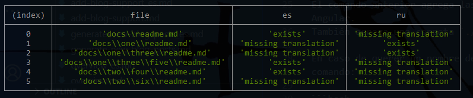

# TranslationSummaryJS

View a summary of missing translation files into a folder

Show data in console

```typescript
import { TranslationSummary } from './translation-summay';

const helper = new TranslationSummary();
const summary = helper.getSummary();

console.table(summary);
```

# Result model

```typescript
export interface FileSummary {
    file: string;
    [key: string]: string;
}
```

## Output

<p>  </p>
